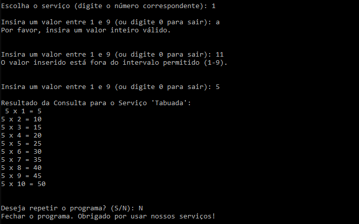

# Descrição do Projeto
Neste Projeto iremos realizar a implementação de um sistema de serviços web baseado em Python, utilizando XML como formato de comunicação entre cliente e os servidores. O objetivo principal é criar uma arquitetura capaz de fornecer a tabuada de um número inteiro inserido pelo cliente. Haverá um mecanismo de registo de serviços entre 2 servidores distintos. Além disso, estabelecemos a comunicação com o servidor de serviços por meio de requisições SOAP (Simple Object Access Protocol), permitindo que os clientes solicitem a tabuada de um número específico e recebam as respostas formatadas em XML.

#Arquitetura do Projeto

A arquitetura implementada  é constituída por 3 intervenientes nomeadamente: o provider, o client e o  server pubisher.

# Implementação do Projeto
Este trabalho consiste na criação de um sistema de tabuada distribuído utilizando a arquitetura de serviços web. O sistema inclui um servidor provider, responsável por calcular e fornecer a tabuada de um número específico, um servidor publisher para registrar e divulgar os serviços oferecidos, e um cliente para interagir com os servidores e solicitar a tabuada desejada.

Passos a Desenvolver

Criação do Server Provider na Porta 8000
O Server Provider é configurado e criado na porta 8000, pronto para oferecer serviços aos clientes.

Criação do Server Publisher na Porta 8001:
O Server Publisher é configurado e criado na porta 8001 para receber e disponibilizar os serviços oferecidos pelo Server Provider aos clientes.

Criação do Cliente:
Um cliente é configurado e criado para interagir com os servidores e solicitar serviços disponíveis.

No Server Provider:

Publicação dos Serviços no Server Publisher na Porta 8000: O Server Provider publica os serviços oferecidos no Server Publisher na porta 8000, permitindo o acesso aos clientes [2] .

Solicitação do Serviço de Cálculo de Tabuada pelo Cliente na Porta 8000: O cliente envia um request ao Server Provider na porta 8000 para solicitar o serviço de cálculo de tabuada.

Response com o Serviço da Tabuada para o Cliente: Após receber a solicitação, o Server Provider processa-a e responde com o serviço da tabuada para o cliente.

No Server Publisher:

Publicação dos Serviços Recebidos do Server Provider: O Server Publisher recebe os serviços publicados pelo Server Provider e os disponibiliza para os clientes.

Cliente:

Request dos Serviços Publicados no Server Publisher na Porta 8001:O cliente procura os serviços publicados no Server Publisher na porta 8001 para obter uma lista dos serviços disponíveis.

Solicitação dos Serviços ao Server Publisher: Após encontrar os serviços desejados, o cliente envia uma solicitação ao Server Publisher para obter os detalhes dos serviços.

Request dos Serviços Publicados:O Server Publisher responde à solicitação do cliente, enviando os serviços publicados de volta ao cliente para que ele possa visualizá-los e selecionar oserviço que quer realizar. Solicitação do Serviço de Cálculo de Tabuada ao Server Provider na Porta 8000 [3] [4].

Processar a Resposta do Server Provider: Após enviar a requisição ao Server Provider, o cliente aguarda a resposta. Quando a resposta é recebida, o cliente processa os resultados e exibe a tabuada calculada na interface do utilizador.

# Funcionamento do projeto	

Para realizar o teste do sistema, é necessário iniciar o programa ServerPublisher no terminal. Este programa é responsável por registrar os serviços disponíveis na porta 8001.
A inicialização deste programa está ilustrada pela figura 2.

Após a inicialização bem-sucedida do ServerPublisher, ele estará pronto para receber solicitações de registro de serviços.
Em seguida, é necessário inicializar o programa Provider na porta 8000. O Provider será responsável por enviar os serviços disponíveis para o ServerPublisher, incluindo o serviço de tabuada. A comunicação entre o Provider e o ServerPublisher pode ser observada nas Figuras 2 e 3.

Além disso, é necessário iniciar o programa de Client.
 Este programa fará uma solicitação da lista de serviços disponíveis ao ServerPublisher e, em seguida, receberá a resposta e apresentará em forma de menu. O cliente também realizará verificações nos parâmetros de entrada para garantir a escolha correta do serviço. A comunicação entre o cliente e o ServerPublisher pode ser visualizada na Figura 4.
Com o ServerPublisher, o Provider e o programa Client em execução, podemos prosseguir para testar o sistema. Este teste envolverá interações com a interface do utilizador, seleção de um serviço, inserção de dados relevantes e observação dos resultados gerados pelo sistema.

Após selecionar o serviço desejado, o cliente envia uma solicitação ao Provider, onde seleciona o número para o qual deseja realizar o serviço. O Provider então responde com o resultado correspondente. A comunicação entre o Provider e o cliente é realizada através do protocolo SOAP.
Quando o cliente recebe a resposta do Provider, é apresentada uma pergunta ao utilizador para verificar se deseja realizar o serviço novamente. Se a resposta for sim, o processo é repetido; se a resposta for não, o programa encerra, como ilustrado na Figura 5.

